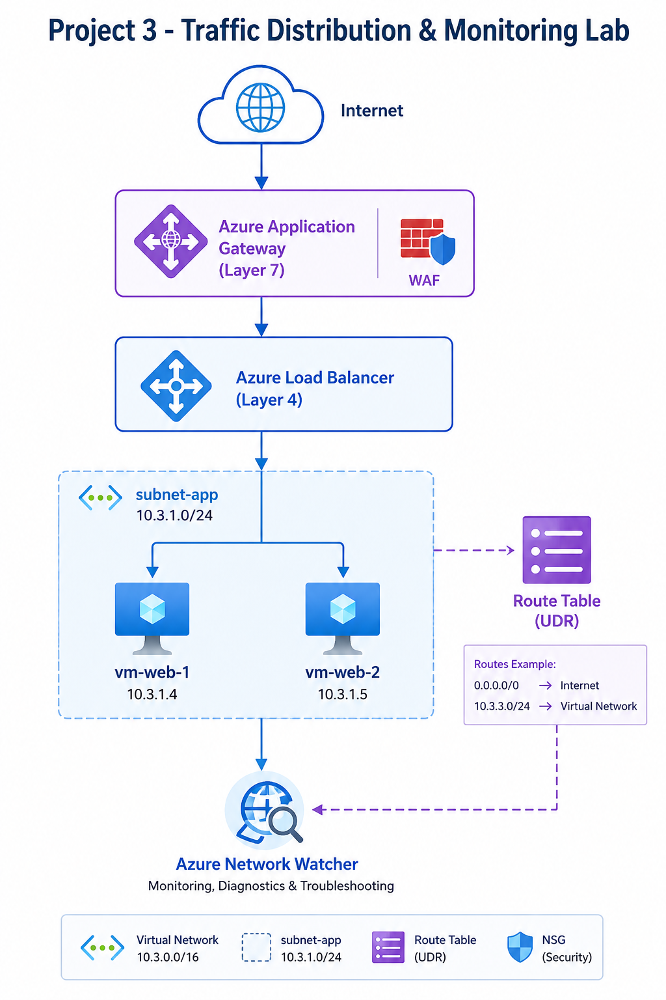

# Project 3: Traffic Distribution & Monitoring Lab

**Load Balancer + Application Gateway + UDR + Network Watcher**

Advanced Azure Networking lab demonstrating traffic distribution, Layer 4 & Layer 7 load balancing, custom routing with UDR, and network monitoring.

## 🎯 Scenario
A company wants to distribute traffic across multiple web servers, publish applications professionally, control routing, and monitor the network.

## 🏗️ Architecture

## 🛠️ Technologies Used
- Azure Load Balancer (Layer 4)
- Azure Application Gateway (Layer 7)
- User Defined Routes (UDR)
- Network Watcher
- IIS Web Servers

## 📋 Lab Content
- [Step-by-Step Guide](./Step-by-Step-Guide.md)
- [Verification & Testing](./Verification.md)

## ✅ Skills Gained
- High availability & traffic distribution
- Layer 4 vs Layer 7 load balancing
- Custom routing with UDR
- Network monitoring and troubleshooting

**Lab Completed Successfully!** 🎉

---

⭐ Star this repo if it helped you with AZ-104!
